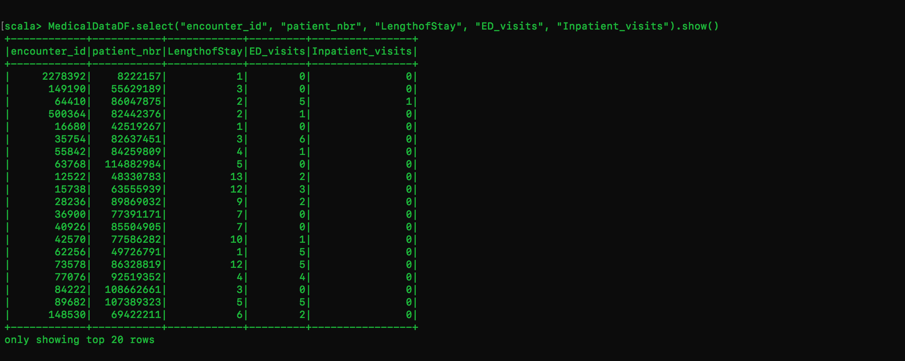
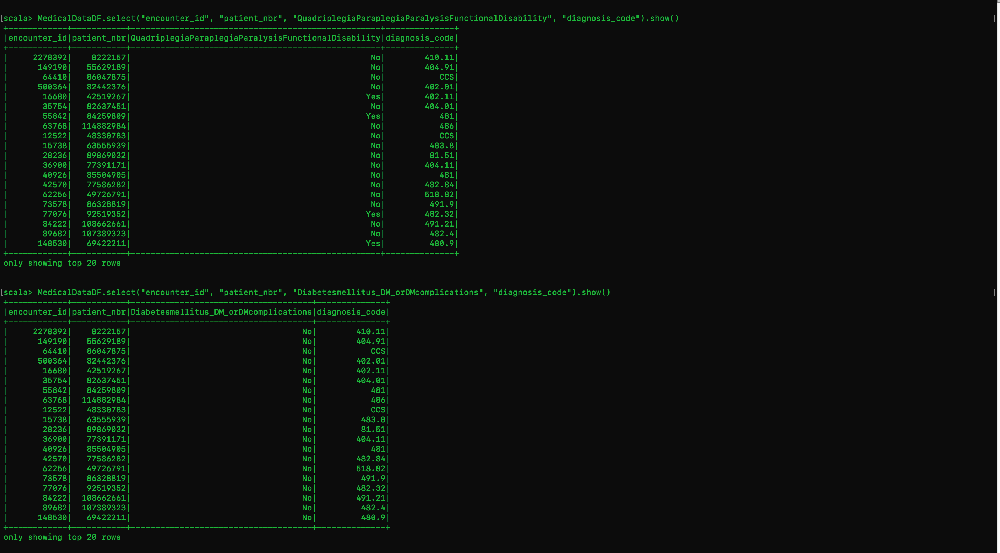
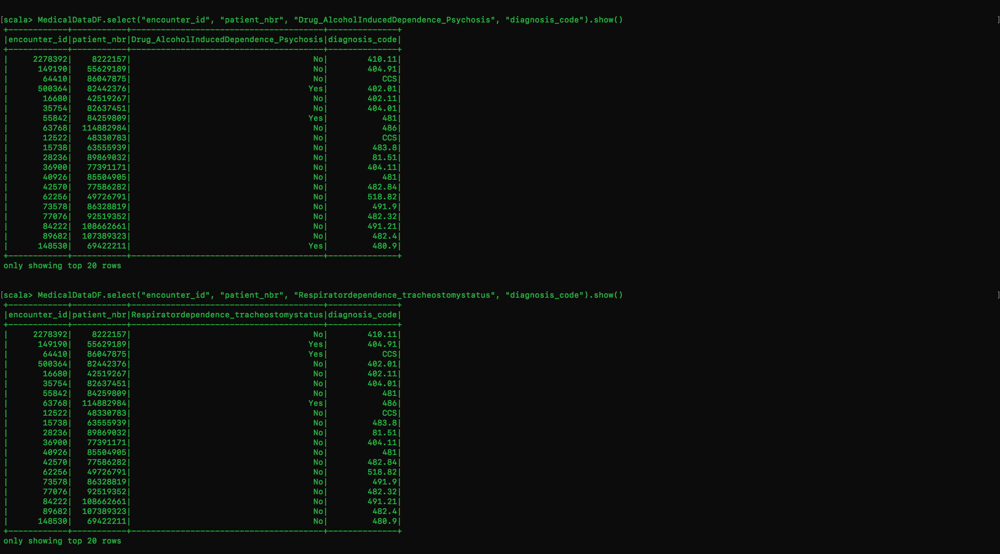
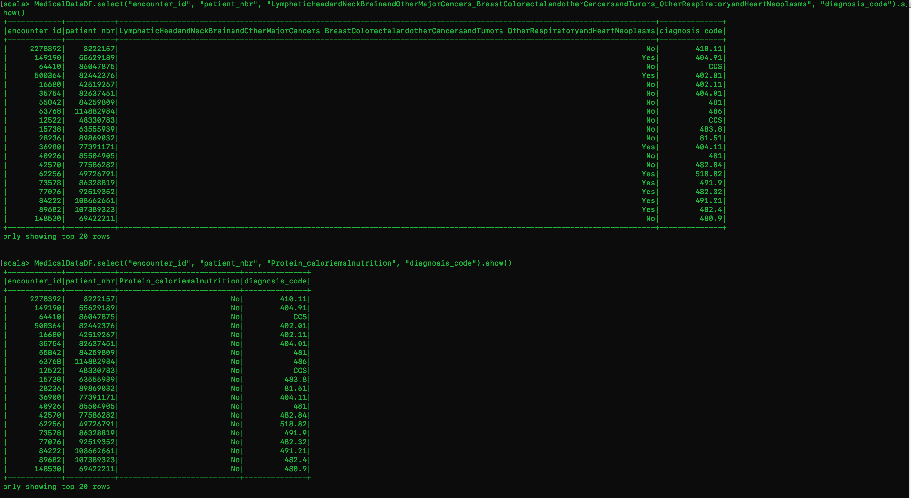
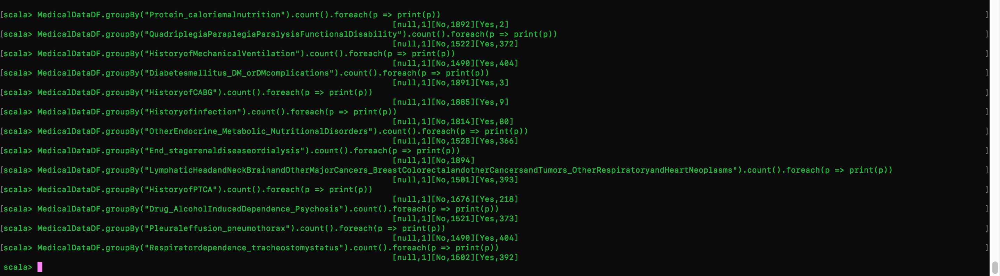
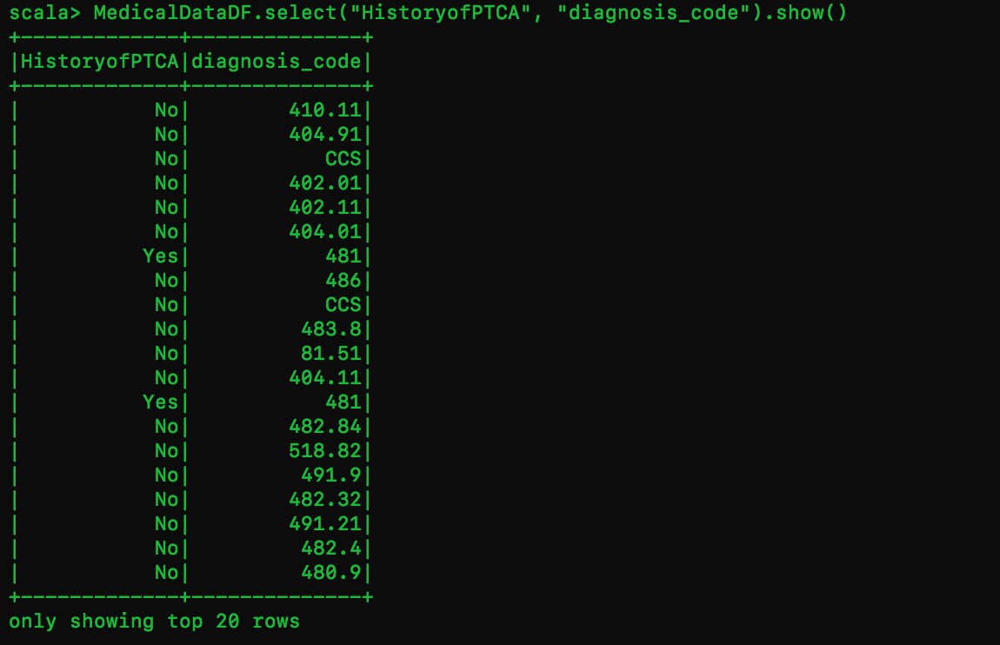
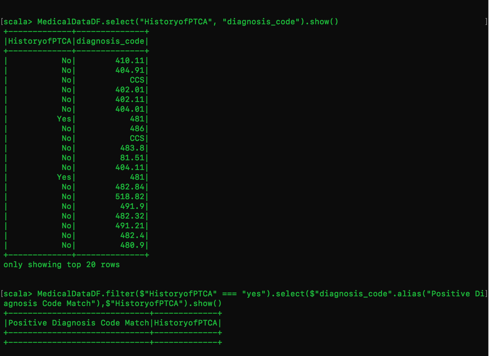

# Server Side Medical Diagnosis Measures Application

##**Description**

The goal of this application is to use Big data tools such as Hadoop or Spark to render patients medical data and filter records based on diagnoses, diagnosis codes, comorbidity, length of stay, acute admissions, and Emergency visits.
For example, the objective is to run a particular medical measure in the application that will return SQL statements. These SQL queries will contain information suh as the comorbidity diagnoses and diagnosis codes that correspond with that measure and will then run against the database.  

##**Getting started**

These instructions will give you a copy of the project open running on your local machine for development purposes.  To run the application, in the command line type `node` followed by `the program name` followed by `medical measure name`.
For example, in the command line you will need to type `node/Diagnosis_Measures/copd copd`

###**Prerequisites**

You will need to install Hadoop 3.1.1 and Spark 2.4.0 and Vagrant.

Please visit the links below for a walk through on installation instructions.

[Hadoop](https://www.digitalocean.com/community/tutorials/how-to-install-hadoop-in-stand-alone-mode-on-ubuntu-18-04
)
- With these installation instructions I was successfully able to set up Hadoop in standalone mode and used the sample map reduce test to verify I set up Hadoop correctly.

[Spark](https://spark.apache.org/downloads.html)
- With these installation instructions I was successfully able to set up Spark 2.4.0 located in the spark folder on the home directory of Vagrant.

[Vagrant](https://app.vagrantup.com/bento/boxes/ubuntu-18.04)
- I used the latest version of Ubuntu as my vagrant box

##**Challenges**
- Setting up Hadoop in stand alone mode
- Installing Spark on Vagrant
- Connecting Spark to Node: Setting up an environment where Spark can read my SQL statements from the sql files.  I tried installing an Odbc Spark driver, but I was denied permission.  I also tried NPM package eclairJs which requires Docker and ran into some set backs with Docker software and pulling the Docker image to configure the Dockerfile.
- Ultimately I had to use the Scala API to import the csv file and build the database.  I have attached some screenshots below of what I was able to successfully build and have more inside of my images folder.

**Lace Table**

**Sample Table 1**

**Sample Table 2**

**Sample Table 3**

**Diagnoses Count**

**HISTORY OF PTCA TABLE**

**HISTORY OF PTCA FILTERED BY "YES", The objective here was to display the diagnosis code alongside those with a value of yes**

###**In building the application I believe I was relatively close to retreiving the desired outcome.  Although the desired outcome was not achieved I feel great that I have learned so much throughout this process!** 

